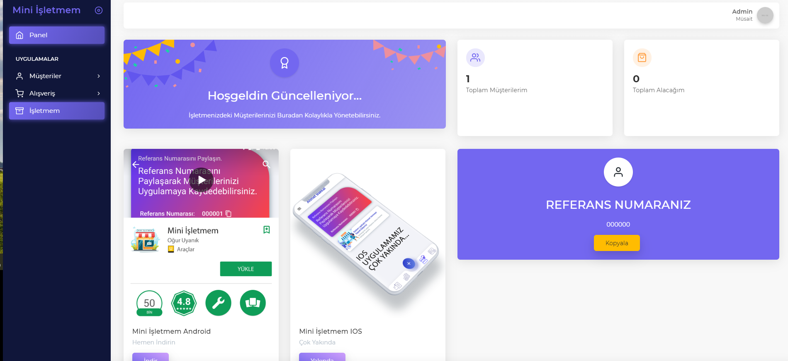
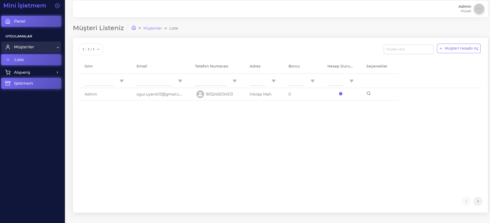

# Laravel Vue CRM

Developed with vue js and laravel framework.





#### Create your environment file:

```bash
cp .env.example .env
```

_The app key is used to salt passwords. If you need to work with production data you'll want to use the same app key as defined in the .env file in production so password hashes match._

#### Update these settings in the .env file:

-   DB_DATABASE (your local database, i.e. "crm")
-   DB_USERNAME (your local db username, i.e. "root")
-   DB_PASSWORD (your local db password, i.e. "")
-   HASHIDS_SALT (use the app key or match the variable used in production)

#### Install PHP dependencies:

```bash
composer install
```

_If you don't have Composer installed, [instructions here](https://getcomposer.org/)._


#### Generate an app key:

```bash
php artisan key:generate
```

#### Generate JWT keys for the .env file:

```bash
php artisan jwt:secret
```

#### Run the database migrations:

```bash
php artisan migrate
```

#### Install Javascript dependencies:

```bash
npm install
```

_If you don't have Node and NPM installed, [instructions here](https://www.npmjs.com/get-npm)._

#### Run an initial build:

```bash
npm run dev
```

### Additional Set Up Tips

#### Database Seeding

If you need sample data to work with, you can seed the database:

```
php artisan migrate:refresh --seed --force
```

Read more in [/docs/database-seeds.md](https://github.com/devinsays/laravel-react-bootstrap/blob/master/docs/database-seeds.md).

#### Seeded User

After seeding the database, you can log in with these credentials:

Email: `user@test.dev`
Password: `password`

#### Email Driver

Laravel sends emails for password resets. The default for MAIL_DRIVER in .env.example is log. You can view logged emails in storage/logs/laravel.log.

## Other Notes

**Internal Docs:**

-   [Code Standards](https://github.com/devinsays/laravel-react-bootstrap/blob/master/docs/code-standards.md)
-   [Automated Testing](https://github.com/devinsays/laravel-react-bootstrap/blob/master/docs/automated-testing.md)
-   [Database Seeding](https://github.com/devinsays/laravel-react-bootstrap/blob/master/docs/database-seeds.md)

**Laravel Docs:**

[https://laravel.com/docs/](https://laravel.com/docs/)

